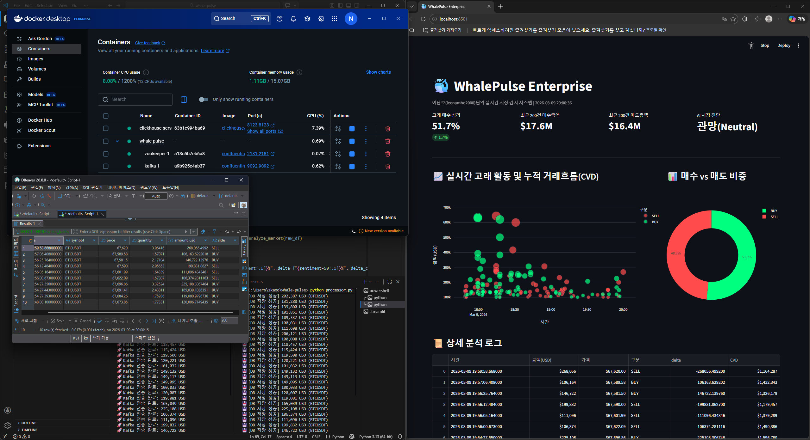
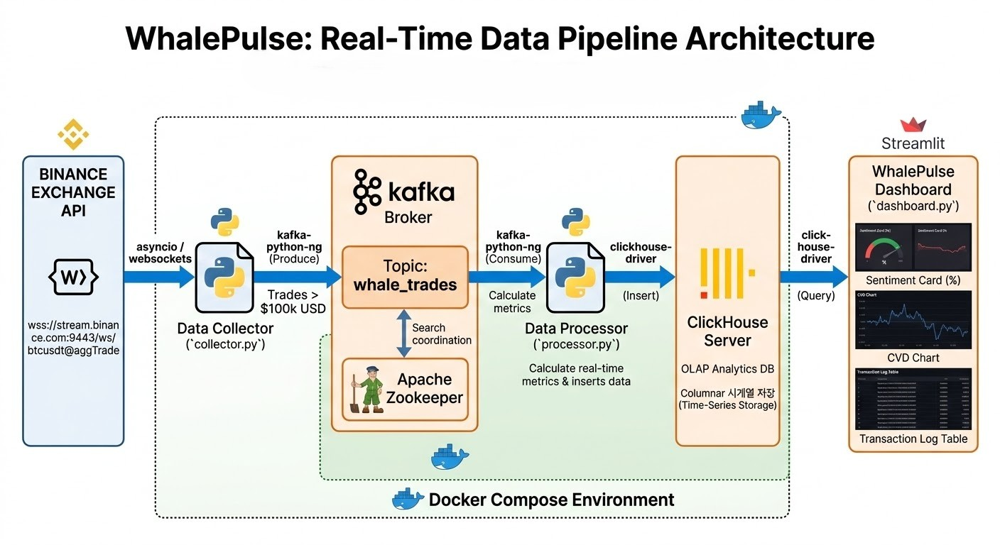
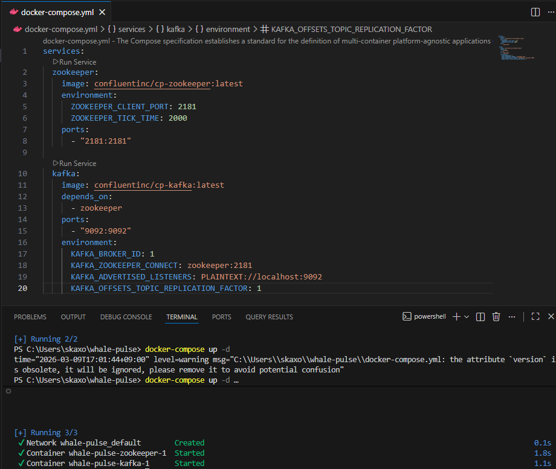
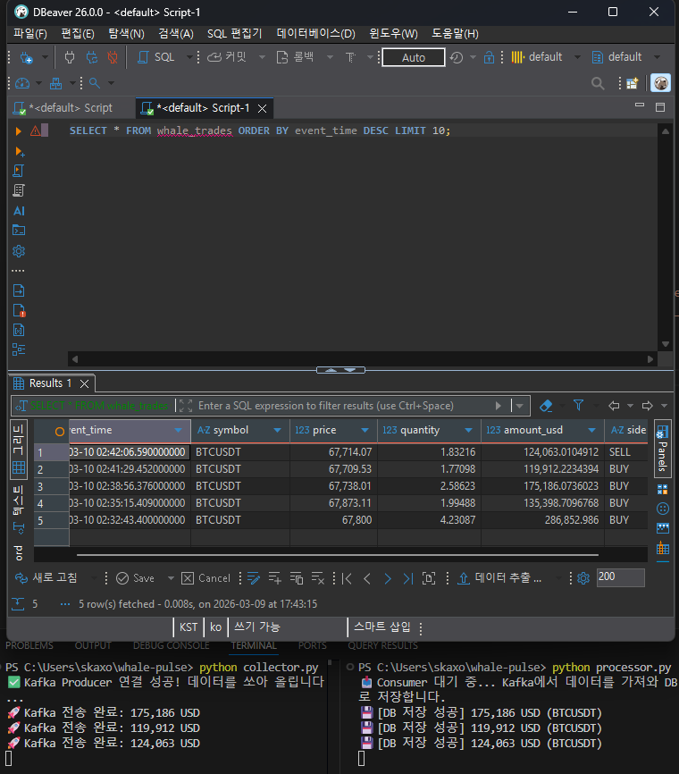
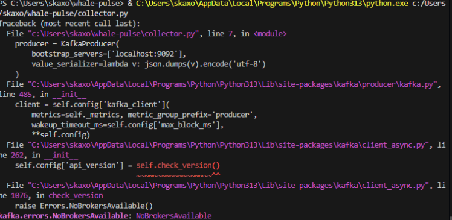
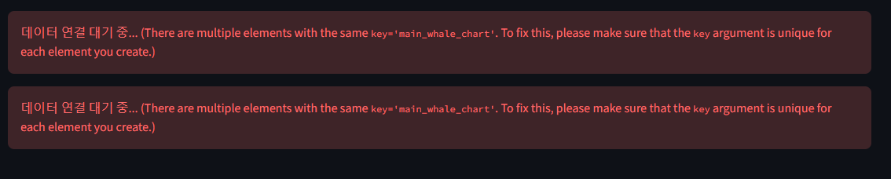

# 🐳 WhalePulse: 초저지연 실시간 고래 체결 및 시장 심리 분석 시스템
> **Real-time Data Engineering Pipeline + Market Surveillance Analytics**

*Docker, DBeaver, Streamlit이 유기적으로 연결된 실시간 감시 시스템의 모습입니다.*

---

## 1. 프로젝트 동기 (Motivation)
암호화폐 시장의 유동성은 소수의 '고래(Whale)'들에 의해 주도됩니다. 하지만 초당 수만 건씩 쏟아지는 체결 데이터 속에서 유의미한 거대 자본의 흐름을 파악하는 것은 불가능에 가깝습니다. 본 프로젝트는 **Apache Kafka를 활용한 데이터 버퍼링**과 **ClickHouse의 고성능 시계열 처리**를 결합하여 실시간으로 세력의 의도를 데이터로 증명합니다.

---

## 2. 시스템 아키텍처 (Architecture)

*본 프로젝트의 엔드 투 엔드 데이터 흐름도입니다.*

### 실시간 데이터 처리 전략
1. **Ingestion Layer:** Python Asyncio 기반 비동기 수집기를 통해 바이낸스(Binance) 데이터를 수집합니다.
2. **Messaging Layer:** 트래픽 폭주 시 데이터 유실을 방지하기 위해 **Kafka**를 완충 지대로 활용합니다.
3. **Storage Layer:** 초당 수만 건의 쓰기 성능에 최적화된 **ClickHouse**를 채택했습니다.
4. **Presentation Layer:** **Streamlit**을 통해 시장 심리 지수(WSI) 및 CVD를 시각화합니다.

---

## 3. 단계별 구현 및 기술적 가치 (Implementation)

### ① 분산 메시징 시스템을 통한 데이터 안정성 확보
갑작스러운 거래량 폭증 상황에서 DB 부하를 관리하기 위해 Kafka 클러스터를 구축했습니다.
* **Action:** Docker Compose를 활용하여 Kafka 및 Zookeeper 환경을 컨테이너화했습니다.
* **Result:** 수집기와 처리기의 속도 차이를 조절하여 무중단 파이프라인을 완성했습니다.

### ② 고성능 시계열 데이터베이스 구축 (OLAP)
대규모 데이터 조회 속도를 확보하기 위해 Columnar DB인 ClickHouse를 설계했습니다.
* **Action:** DBeaver를 연동하여 실시간으로 유입되는 고래 데이터를 SQL 기반으로 검증했습니다.
* **Result:** 수천 건의 트랜잭션을 실시간으로 인서트하고 즉각적으로 조회하는 환경을 구축했습니다.

### ③ 도메인 중심의 시장 진단 지표 산출
단순 거래 내역 나열을 넘어, 투자 의사결정을 돕는 분석 로직을 직접 설계했습니다.
* **Whale Sentiment Index:** 매수/매도 고래 거래량 비중을 통해 시장 심리를 수치화합니다.
* **Real-time Metrics:** 최근 200건의 매수/매도 총액을 계산하여 AI 시장 진단 결과를 도출합니다.

---

## 4. 엔지니어링 트러블슈팅 (Troubleshooting)

#### ① Python 3.13 호환성 및 라이브러리 충돌
* **Issue:** `kafka-python` 라이브러리가 최신 파이썬 버전에서 `NoBrokersAvailable` 에러를 발생시킴.
* **Solution:** 최신 환경을 지원하는 `kafka-python-ng` 라이브러리로 교체하여 해결했습니다.

#### ② 리소스 이름 충돌 및 컨테이너 관리
* **Issue:** 이미 생성된 컨테이너 이름으로 인해 Docker 실행이 실패함.
* **Solution:** `docker rm -f` 명령어로 기존 리소스를 정리하고 설정을 통합 관리하여 해결했습니다.

#### ③ Streamlit UI 렌더링 및 ID 충돌
* **Issue:** 실시간 갱신 중 엘리먼트 ID가 중복되어 대시보드가 중단됨.
* **Solution:** `st.rerun()` 시스템을 도입하여 UI 업데이트 안정성을 확보하고 중복 ID 에러를 제거했습니다.

---

## 5. 프로젝트 성과 및 회고
* **통합 인프라 구축:** Docker 기반의 컨테이너화를 통해 모든 파이프라인이 유기적으로 작동하는 환경을 완성했습니다.
* **분석가적 역량 입증:** 가공되지 않은 Raw 데이터를 '시장 심리 지표'로 정제하여 데이터의 비즈니스 가치를 극대화했습니다.